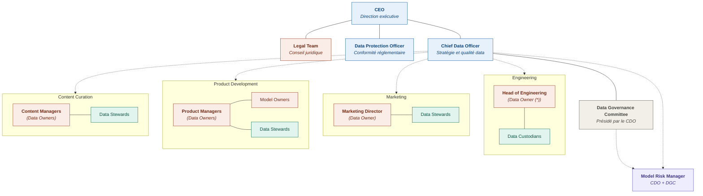

```mermaid
flowchart TD
    CEO["<b>CEO</b><br/><i>Direction exécutive</i>"]

    Legal["<b>Legal Team</b><br/><i>Conseil juridique</i>"]
    DPO["<b>Data Protection Officer</b><br/><i>Conformité réglementaire</i>"]
    CDO["<b>Chief Data Officer</b><br/><i>Stratégie et qualité data</i>"]
    DGC["<b>Data Governance Committee</b><br/><i>Présidé par le CDO</i>"]
    MRM["<b>Model Risk Manager</b><br/><i>CDO + DGC</i>"]

    subgraph ENG["Engineering"]
        direction TB
        HoE["<b>Head of Engineering</b><br/><i>(Data Owner (*))</i>"]
        CUST["Data Custodians"]
        HoE --- CUST
    end

    subgraph MKT["Marketing"]
        direction LR
        MD["<b>Marketing Director</b><br/><i>(Data Owner)</i>"]
        MST["Data Stewards"]
        MD --- MST
    end

    subgraph PD["Product Development"]
        direction LR
        PM["<b>Product Managers</b><br/><i>(Data Owners)</i>"]
        MO["Model Owners"]
        PST["Data Stewards"]
        PM --- MO
        PM --- PST
    end

    subgraph CC["Content Curation"]
        direction LR
        CM["<b>Content Managers</b><br/><i>(Data Owners)</i>"]
        CST["Data Stewards"]
        CM --- CST
    end

    CEO --- Legal
    CEO --- DPO
    CEO --- CDO
    CDO --- DGC
    DGC -.-> MRM
    CDO -.-> MRM

    CDO -.-> MKT
    CDO -.-> PD
    CDO -.-> CC
    CDO -.-> ENG

    classDef exec fill:#E6F1FB,stroke:#185FA5,color:#0C447C
    classDef dept fill:#F1EFE8,stroke:#5F5E5A,color:#444441
    classDef risk fill:#EEEDFE,stroke:#534AB7,color:#3C3489
    classDef owner fill:#FAECE7,stroke:#993C1D,color:#712B13
    classDef steward fill:#E1F5EE,stroke:#0F6E56,color:#085041

    class CEO,DPO,CDO exec
    class Legal,MD,PM,CM,HoE owner
    class DGC dept
    class MRM risk
    class MO owner
    class CUST,MST,PST,CST steward
```
