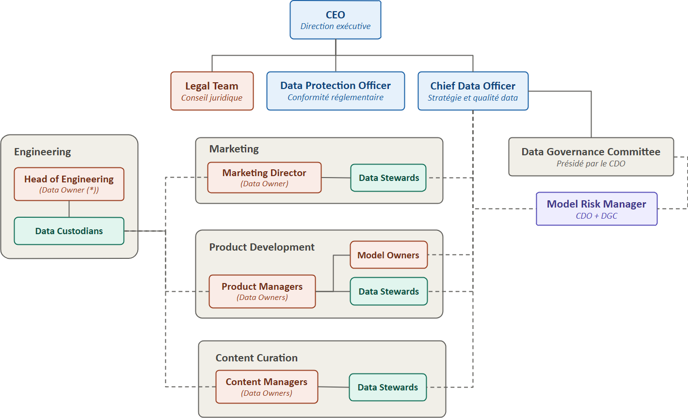

*SPOTIFY'S DATA & AI GOVERNANCE* PROJECT
===

# 4. Presentation To Stakeholders

> *Nicolas Pichon - AIA RNCP 38777 / BC01 - Présentation du 2026/10/13 - v4.*

---

## Slides
### Slide 1 - Titre

**Gouvernance des Données et de l'IA**
*Evaluation, organisation et plan de mise en œuvre*

- 450M+ utilisateurs actifs
- 200M abonnés premium
- 180+ pays d'opération

> *Note : Spotify opère à l'échelle mondiale avec une dépendance forte aux données (recommandation, personnalisation, monétisation). Le projet répond à une demande de cadrage transverse - gouvernance des données ET de l'IA. Objectifs de la session : validation du cadre de gouvernance, de sa politique, de son organisation, du plan d'implémentation pilote et de sa généralisation.*

*Source : \[R0\], \[R2\]*

---

### Slide 2 - Diagnostic

**Une maturité data en phase initiale, un potentiel analytique déjà avancé**

| Dimension | Niveau |
|---|---|
| Data Governance | 1 |
| Data Quality | 1 |
| Data Architecture | 1 |
| Data Operations | 1 |
| Compliance | 1 |
| Data Usage & Accessibility | 2 |
| Data Security | 1 |
| Data Literacy | 2 |
| Master & Reference Data | 1 |
| Metadata | 1 |
| Data Integration | 1 |
| Analytics & BI | 2 |

**Niveau moyen actuel : 1,25 / 5**
    - gouvernance locale, réactive, dispersée.

**Cible à moyen terme : niveau 3** \[D21 §2.1.7\] 
    — gouvernance formellement définie et appliquée de façon cohérente à l’échelle de l’entreprise.

Le cadre de gouvernance est partiellement défini (rôles, outils) mais pas encore déployé (manque organisation, adoption, audit, monitoring, politique appliquée).

> *Note : 12 dimensions couvrant à la fois les critères du DMAT Australien \[R1\] et les dimensions modèles \[R3\]. Application de la méthodologie du DMAT au business case Spotify \[R2\]. Points d'appui de maturité 2 : usage/accessibilité, littératie data, analytics & BI (le système de recommandation est déjà en production). Message clé : l'entreprise sait déjà produire de la valeur avec la donnée, mais n'a pas encore la vision globale de sa gouvernance qui lui assurerait de conserver cette capacité.*

*Source : \[D1\], \[R1\]*

---

### Slide 3 - Enjeux

**Six enjeux majeurs - par ordre de criticité**

| # | Enjeu | Description |
|---|---|---|
| E1 | Décompartimenter les données | Silos départementaux → vues incohérentes ou incomplètes, angles morts décisionnels |
| E2 | Maîtriser la qualité des données | Données et métadonnées inexactes → recommandations dégradées, règles de qualité à définir |
| E3 | Conformité multi-juridictionnelle | Concilier GDPR, CCPA + réglementations locales et maintien de la cohérence globale |
| E4 | Vie privée & usage éthique | Transparence, contrôle utilisateur, anonymisation, au-delà de la seule conformité légale |
| E5 | Gouverner les données et les modèles ML/IA | Traçabilité, biais, responsabilité des modèles du système de recommandation en production |
| E6 | Monter en compétences data-driven | Culture de gouvernance partagée encore à construire ; risque de résistance au changement |

> *Note : ordre de criticité justifié dans \[D1\]. E5 n'est pas identifié comme un enjeu dans le business case \[R2\] et il est issu du diagnostic.*

*Source : \[D1\] §1.2, enjeux dérivés de \[R2\]*

---

### Slide 4 - Politique de gouvernance

**Neuf principes structurent le cadre de gouvernance**

| Cluster | Principes |
|---|---|
| Appropriation & qualité des données | **P1** Responsabilité : un responsable / actif de données et / modèle - **P4** Qualité : règles mesurables, auditées régulièrement |
| Confiance de l'utilisateur | **P2** Transparence : information claire et gestion du consentement - **P6** Minimisation : collecte limitée aux finalités métier - **P7** Droits des utilisateurs : accès, modification, suppression, opposition |
| Sécurité & conformité réglementaire | **P3** Sécurité : chiffrement, accès / rôle, PCI-DSS - **P5** Conformité : GDPR, CCPA, PCI-DSS, réglementations locales, veille continue |
| Gouvernance IA & amélioration continue | **P8** Gouvernance & éthique de l'IA : traçabilité, biais, explicabilité - **P9** Amélioration continue : revues périodiques de réalignement DMAT |

> *Note : P8 est le principe le plus opérationnalisé avec ses 4 exigences concrètes (traçabilité, biais, responsabilité/approbation proportionnée, explicabilité). Une adaptation des workflows de déploiement des modèles ML/IA à leur impact sur les utilisateurs est proposée dans le plan d'implémentation \[D3 annexe 3.E\] - détails slide 7.*

*Source : \[D21\] §2.1.3, \[R4\]*

---

### Slide 5 - Organisation

**Un modèle *Center of Excellence* adapté à Spotify**

**Trois modèles courants :**
- **Centralisé** --> *rejeté* : isole la fonction data en : défaisant la littératie et l'autonomie analytique établies des départements & retirant aux départements l'autorité de proximité nécessaire à la décompartimentation (E1).
- **Embarqué** --> *rejeté* : reconduit les silos (E1) + aggrave la conformité multi-juridictionnelle en dispersant les ressources juridiques (E3).
- **Center of Excellence (CoE)** --> **retenu** : répond simultanément aux enjeux E1, E3 et E5.

**Ecarts du modèle Spotify par rapport au modèle canonique** :
- Infrastructure technique maintenue dans *Engineering* (traité comme département pair, pas comme hub).
- Autorité de conformité (DPO/Legal) séparée de l'autorité de gouvernance (CDO/DGC), toutes deux rattachées directement au CEO, sans hiérarchie entre elles.

**Le mécanisme charnière** : rattachement fonctionnel des Data Stewards au CDO, organisationnel au département --> principal levier contre le cloisonnement (E1).

*Trait plein = rattachement hiérarchique · Trait pointillé = rattachement fonctionnel / transverse*

> *Note : 
> - CDO, DPO et Legal Team rapportent au CEO (independance DPO exigee par GDPR-38). CDO préside DGC. MRM rapporte au CDO au quotidien mais peut escalader directement au DGC -- ce qui preserve son independance vis-a-vis des equipes dont il evalue les modeles. DCs sont centralises dans Engineering mais servent tous les departements transversalement. MOs sont intégrés dans Product Development (là où les modèels sont développés), séparés du MRM (separation execution / controle).
> - Le surcoût de coordination du CoE (justifié pour les grandes structures uniquement) est assumé : à l'échelle de Spotify (450M+ utilisateurs, 180+ pays, départements autonomes, régimes réglementaires hétérogènes) cette charge est une nécessité structurelle. Détails de la comparaison des 3 modèles → backup B1.* 

*Source : \[D22\], \[D3\] §3.3, annexe 3.B*

---

### Slide 6 - Outillage 

**Une sélection d'outils avancés**

**Principes de sélection** \[D3 §3.C.1\] :
1. Repartir des recommandations \[R8\], les compléter d'alternatives open source, prioriser l'open source.
2. L'économie de licence open source est généralement compensée par le coût d'hébergement/exploitation — mais la capacité d'ingénierie interne de Spotify \[R2\] permet de la maintenir au niveau des solutions propriétaires équivalentes.
3. Les enjeux à risque réglementaire chiffrable (E3, E4) justifient des garanties contractuelles commerciales ; les enjeux organisationnels/opérationnels (E1, E2, E5) ne portent qu'un coût de défaillance interne, sans comparaison avec le coût d'une amende.

| Catégorie | Outil retenu | Argument clé | Enjeux |
|---|---|---|---|
| Catalogage | OpenMetadata + Collibra | Connecteurs cloud natifs (vs Apache Atlas, ancré Hadoop) ; Collibra pour son socle de gouvernance prédéfini | E1 |
| Qualité | Soda Core | Contrôles déclaratifs, connecteurs adaptés à la stack Spotify ; Talend/Informatica/Ataccama écartés (redondance, profil de compétence inadapté, coût disproportionné) | E2, E5 |
| Conformité | TrustArc | Seule solution (avec OneTrust) à garantir RoPA/DPIA/BN/DSAR avec SLA contractuel ; retenue pour son automatisation multi-juridictionnelle et l'ergonomie DPO | E3, E4 |
| Sécurité | Wazuh + OpenBao | OpenBao retenu sur Vormetric (mêmes services de gestion des clés, sans coût de licence) | P3 |
| Gouvernance IA | MLflow, DVC, AIF360, AIX360 | Catalogage de modèles, versionnage, détection de biais, explicabilité — tous open source | E5 |

> *Note : deux réserves documentées sur Soda Core — solution de repli Cuallee si les contrôles statistiques ML s'avèrent insuffisants (E5), solution de repli TestGen si la feuille de route éditeur se réoriente vers l'offre commerciale Soda Cloud. Justification complète par outil (y compris solutions écartées) → backup B2.*

*Source : \[D3\] §3.4, §3.C · Alternatives évaluées : \[R8\]*

---

### Slide 7 - Gouvernance de l'IA : une responsabilité proportionnée

**Une responsabilité proportionnée au niveau d'impact**

**Quatre exigences** \[D21 §2.1.5\] : traçabilité des données d'entraînement · détection des biais · responsabilité et approbation proportionnée au niveau d'impact · explicabilité.

**Trois activités distinctes, à ne pas confondre** \[D3 annexe 3.E\] :
- **Classification** — porte sur le modèle, événement **unique** à sa création dans le registre MLflow.
- **Approbation de déploiement** — porte sur une version, se répète à **chaque mise en production**, hérite directement du niveau fixé sans le rouvrir.
- **Reclassification** — événement **rare** (changement substantiel ou détection en audit).

*Confondre ces trois activités reviendrait à payer à chaque cycle de release un coût de classification qui ne devrait être payé qu'une fois.*

| Niveau d'impact | Critères (2 automatisables, 2 déclaratifs) | Circuit de validation |
|---|---|---|
| **Fort** | Portée majorité des utilisateurs *(auto)* · art. 22 GDPR *(auto)* · décision peu réversible *(décl.)* · fonctionnalité principale *(décl.)* | MO (C) → MRM (R) → DGC (A) |
| **Modéré** | Portée partielle *(auto)* · décision réversible sous délai court *(décl.)* | MO (R) → MRM (A) |
| **Faible** | Aucun critère de fort impact rempli (par défaut) | MO (RA) · contrôle a posteriori par MRM (échantillonnage) |

*Le nombre de parties prenantes décroît mécaniquement avec le niveau d'impact — la proportionnalité est visible dans la matrice elle-même.*

> 🎤 *Note : le DGC est Accountable sur l'approbation des modèles à fort impact, alors que le CDO — qui préside le DGC — n'est que Consulted : volontaire, pour éviter que le CDO soit juge et partie sur ses propres arbitrages IA. Trois matrices RACI complètes (classification / approbation / contrôle & reclassification) → backup B3.*

*Source : \[D21\] §2.1.5 · Amendement \[D3\] annexe 3.E*

---

### Slide 8 - Implémentation d'un pilote

**Périmètre pilote** : modèles et données d'entraînement du système de recommandation dans la limite du département *Product Development*.
**Durée** : 21 semaines, en 4 grandes phases :

| Phase | Semaines | Contenu |
|---|---|---|
| Sécurisation *(bloquante)* | S1-S7 | Annuaire central, migration des accès, test d'intégration bout-en-bout, revue de poursuite/suspension |
| Déploiement technique | S8-S17 | Outils (OpenMetadata, DVC, Soda Core, MLflow, AIF360, AIX360, Wazuh, OpenBao) + population du RoPA en parallèle |
| Classification & exécution réelle | S14-S17 | Classification du modèle, contrôle qualité courant et données d'entraînement |
| Approbation & clôture | S18-S21 | Premier passage du circuit d'approbation, consolidation, revue finale |

**7 objectifs** \[D3 §3.F.2\] : valider le rattachement fonctionnel DS-CDO · mesurer l'*Engineering overhead* réel (main-d'œuvre uniquement) · classifier les modèles et éprouver le circuit d'approbation · trancher 5 points de vigilance technique (recouvrement Soda Core/OpenMetadata, suffisance de Soda Core pour E5, charge IAM Wazuh/OpenBao, connecteur Collibra-OpenMetadata, synchronisation SSO — non documentée pour TrustArc) · valider le déploiement incrémental de Collibra/TrustArc · vérifier la classification préalable des données du RoPA · conduire la migration de sécurisation obligatoire du stockage initial.

**Équipe** : PPM (coordination) · DS (qualité domaine, glossaire) · MO (MLflow, classification) · MRM (revue, approbation) · DO (arbitrage métier) · DC (déploiement technique, migration) · DPO/Legal (RoPA).

**Indicateurs (DMAT, artefacts datés, validés par le DGC)** :

| Dimension | Départ | Cible pilote |
|---|---|---|
| Data Governance | 1 | 2 |
| Data Quality | 1 | 2 |
| Analytics & BI (gouvernance IA) | 2 | 3 |

Le double rattachement des Data Stewards est évalué séparément par 5 indicateurs (adoption des standards, délai de propagation, fréquence de sollicitation, cohérence terminologique, autonomie départementale préservée) — captés nativement dans Collibra, combinés au critère négatif « absence de conflit rapporté » pour éviter qu'un canal inutilisé ne passe pour un succès.

**Risques** — deux catégories propres à la phase de sécurisation : **suspension sans repli** (ex. absence d'annuaire central → chantier séparé) et **débordement de planning** (ex. délai de réponse TrustArc, exécution réelle compressée à 4 semaines — la plus courte de toutes les versions de calendrier envisagées). S'y ajoutent des risques opérationnels (charge DC sous-estimée, Soda Core insuffisant pour E5, classification préalable du RoPA absente, etc.).

**Formation** : session dédiée DS/PM sur le double rattachement (E6) ; revue finale structurée en 3 axes (ce qui a fonctionné / ce qui a nécessité un ajustement / ce qui reste non résolu).

> 🎤 *Note : la conformité RGPD complète (E3/E4) reste hors périmètre du pilote — un RoPA scopé à un seul département ne vaut pas conformité article 30. Calendrier détaillé des 16 jalons, méthode complète de mesure et liste intégrale des risques → backups B4, B5, B6.*

*Source : \[D3\] §3.4-§3.5, annexes 3.F*

---

### Slide 9 - Feuille de route de généralisation

**Une généralisation en quatre phase pour monter au niveau 3**

**Pourquoi la phase de sécurisation ne se reproduit qu'une fois** : l'annuaire central, les rôles OpenBao et les intégrations SSO validés en phase 1 sont *étendus*, pas reconstruits. Seule une migration allégée (régénération des secrets, collecte des profils) est reconduite par département — d'où une **durée canonique réduite à 3 mois (12 semaines)** pour les phases 2 à 4, contre 21 semaines pour la phase 1.

**L'intervalle entre phases est porté à 2 mois** (contre 1 mois initialement) pour absorber le risque d'alignement aux cycles budgétaires trimestriels.

| Phase | Périmètre | Durée | Fin cumulée | Justification de l'ordre |
|---|---|---|---|---|
| 1 (réalisée) | PD — entraînement recommandation | 21 sem. | M5 | Pilote, cf. slide 8 |
| 2 | PD — reste des activités | 3 mois | M10 | Capitalise sur l'équipe formée et les outils déjà déployés ; coût marginal faible. Retarde volontairement Marketing |
| 3 | Marketing | 3 mois | M15 | Concentre E1 (silos documentés \[R2\]) et E3/E4 (données d'engagement publicitaire sous consentement GDPR/CCPA) — périmètre le plus exposé |
| 4 | Content Curation | 3 mois | M20 | E2 et gouvernance des métadonnées (Metadata, Master & Reference Data restées en niveau 1), sans la complexité IA déjà éprouvée |
| Consolidation | Ensemble des départements | — | M22-M24 | Niveau 3 généralisé \[D21 §2.1.7\] |

*Ce séquencement atteint la borne haute de la fourchette de référence \[R11, Q7\] (15-24 mois) — un compromis assumé : la rigueur de sécurisation et les marges renforcées coûtent du temps, jusqu'à la limite de ce que la référence exécutive considère acceptable.*

**Passage à l'échelle non automatique** : chaque dispositif (double rattachement, recouvrement Soda Core/OpenMetadata, connecteur Collibra, seuils de classification, déploiement incrémental Collibra/RoPA) reçoit une décision **feu vert / orange / rouge**, adossée aux KPIs et aux risques du pilote.

**Ajustements attendus au cadre de gouvernance** \[D3 §3.G.3\] : intégration formelle de l'amendement de proportionnalité dans \[D21\]/\[D22\] · révision du tableau d'outils sur les 2 lignes testées · TCO complet une fois un historique d'exploitation disponible · validation séparée de la couverture DSAR par DPO/Legal avant la Phase 3 · procédure documentée de l'extension légère de sécurisation par département.

> 🎤 *Note : chaque jalon de phase est un point de réévaluation, pas un engagement figé — conformément au principe d'amélioration continue (P9). Table complète des critères feu vert/orange/rouge et des 5 ajustements attendus → backups B7, B8. Trajectoire de maturité détaillée par dimension → backup B9.*

*Source : \[D3\] §3.6, annexes 3.G*

---

### Slide 10 - Valeurs métiers & au-delà

**Une gouvernance de confiance et de croissance**

**Quatre piliers de valeur** \[R11, Q3\] :
- **Économies** — réduction des inefficiences liées à une donnée de mauvaise qualité
- **Conformité** — éviter les sanctions GDPR/CCPA (jusqu'à 4 % du CA mondial)
- **Confiance** — transparence et sécurité renforcées auprès des utilisateurs
- **Scalabilité** — infrastructure de gouvernance prête pour la croissance mondiale

**Prochaines étapes :**
1. Lancer le pilote sur le système de recommandation (Product Development)
2. Nommer / confirmer DPO, CDO, Data Stewards et Model Owners
3. Première revue de maturité DMAT au jalon intermédiaire (M5)
4. Décision de passage à l'échelle (feu vert / orange / rouge) à chaque jalon de phase

> 🎤 *Note : les prochaines étapes sont volontairement concrètes et actionnables dès la sortie de cette réunion. La gouvernance des décisions de passage à l'échelle se fait phase par phase, pas comme un engagement global figé sur 24 mois.*

*Source : \[R11\], \[D3\] §3.6*

---
## Sources

- \[R0\] Spotify Data & AI Governance Project
- \[R1\] Australian Government Data Maturity Assessment Tool (2026)
- \[R2\] Spotify Business Case
- \[R4\] Governance Principles Guide
- \[R8\] Tech Tools Overview
- \[R11\] Executive Q&A Guide
- \[D1\] Data Maturity Assessment Report
- \[D21\] Data Governance Policy Document
- \[D22\] Roles and Responsibilities Organizational Chart
- \[D3\] Implementation Plan (corps + annexes 3.A-3.G)

## Annexes

Les slides de backup détaillant la comparaison des modèles organisationnels, la justification complète de l'outillage, les matrices RACI de gouvernance IA, le calendrier détaillé du pilote, la méthode de mesure et la gestion des risques sont regroupées dans le document séparé *spotify-step-4-presentation--v2--annexes.md*.
